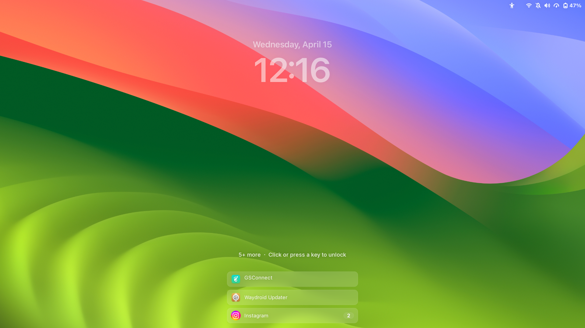
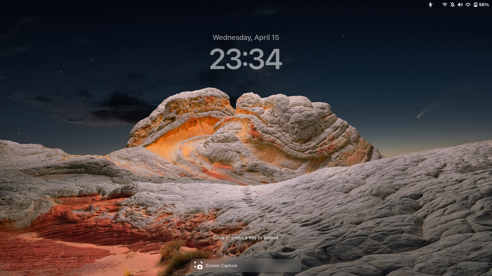

# WACK – Sonoma Lockscreen

<p align="center">
  
  
</p>

This is a part of the WACK project (WACK Ain't Cupertino, Kid), a collection of tweaks aimed at bringing a refined, macOS-inspired aesthetic to the GNOME desktop.

This specific extension focuses on the lock screen (unlockDialog), replacing the standard clock with a clean, Sonoma-inspired layout.

## Features, and What it does
- Custom Clock Layout: Repositions the date and time to the upper third of the screen for a more balanced, spacious feel.

- Focused Interaction: The background stays sharp and clear in its resting state. A deep, smooth blur only fades in when you're ready to enter your password, keeping the focus on the prompt.

- Enhanced Readability: Notification cards feature an adaptive blur (which crossfades with the prompt blur), ensuring text remains crisp and legible regardless of your wallpaper.

- Clean Notification Management: Limits the number of visible cards to prevent lockscreen clutter, capping them with a subtle "more" notice to keep things organized.


## Best Used With
This extension is designed to complement the default Adwaita theme (Adwaita Sans default font in mind),and various other GNOME desktop configurations, but works standalone. For the closest Sonoma feel:

- **[Open Runde](https://github.com/lauridskern/open-runde)** — Recommended font for the clock numerals. Install and set `font-family: 'Open Runde'` in `stylesheet.css` under `.wack-time`. Approximates SF Pro Rounded's warmth at large sizes.

- **[Inter](https://rsms.me/inter/)** — Recommended for date and hint text. 

> Neither font is bundled. Install system-wide (`~/.local/share/fonts/`) or per-user and run `fc-cache -fv` after.


## Technical Details
- Lightweight: No extra background processes or heavy setting schemas.

- State-Aware: Uses ```set_enabled``` logic for blur effects (the notif blur-prompt blur crossfade) to keep your GPU happy.

- Vanilla Compatibility: Built primarily for GNOME 45–50 (IMPORTANT: See Compatibility Below). 


## Install / update (one-step Makefile)
Prereqs: `make`, `rsync`, GNOME Shell 45–50.

```bash
git clone https://github.com/rinzler69-wastaken/wack-sonoma-lockscreen.git
cd wack-sonoma-lockscreen
make            # copies into ~/.local/share/gnome-shell/extensions/wack-lockscreen-clock@rinzler69-wastaken.github.com
```

Then reload GNOME Shell (`Alt+F2` → `r` on Xorg; logout/login on Wayland) and enable:

```bash
gnome-extensions enable wack-lockscreen-clock@rinzler69-wastaken.github.com
```

If you prefer one command after clone:

```bash
make enable
```

Manual Tweak: If you want to change the blur strength or clock position, you can find the constants right at the top of ```extension.js.```

## Compatibility
- Developed and tested on GNOME 50 (Fedora). Reported issues on GNOME 49 + NVIDIA. GNOME 48 support is experimental. More issues are yet to be known since tests are yet to be made for other configurations. Feel free to open an issue if bugs are found, or clone and contribute!

## About the WACK Project
- WACK (WACK Ain't Cupertino, Kid) brings the best design patterns and details from macOS to the GNOME Desktop — dock magnification, traffic-light window controls, lockscreen layout, quick settings layouts, and many more to come — built entirely within what GNOME already gives you.