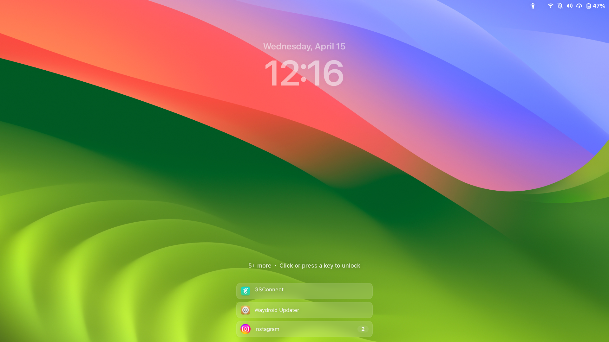
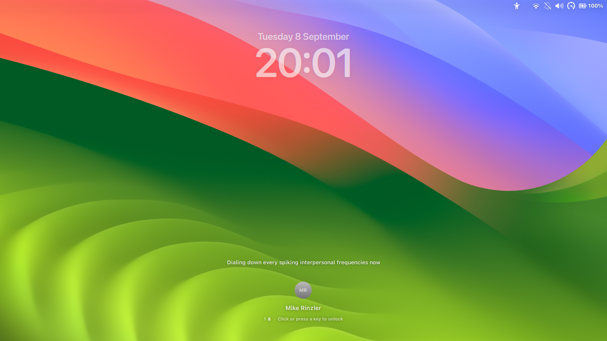
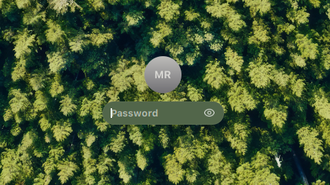
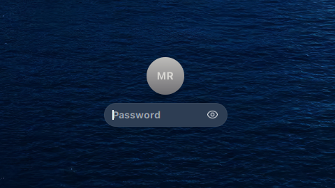
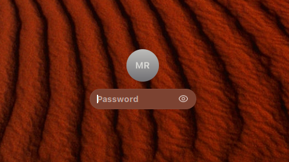
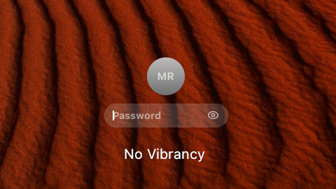
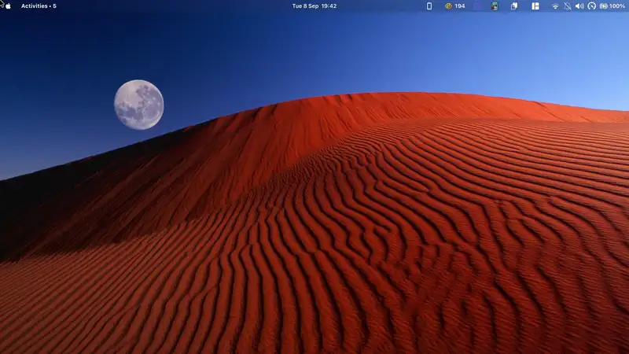

# GNOME Shell Extension — WACK Sonoma Lockscreen

[](https://extensions.gnome.org/extension/9713/wack-sonoma-lockscreen/)

[](https://github.com/rinzler69-wastaken/wack-sonoma-lockscreen/stargazers)
[](https://github.com/rinzler69-wastaken/wack-sonoma-lockscreen/blob/master/LICENSE)
[](https://github.com/rinzler69-wastaken/wack-sonoma-lockscreen/releases)


A GNOME Shell extension that brings a macOS Sonoma-inspired lock screen experience to your GNOME Desktop — with two full layout modes, wallpaper-adaptive theming, GDM login screen support, and a growing collection of thoughtful quality-of-life features.

<p align="center">
  
  
</p>

This is a part of the **WACK Project** (WACK Ain't Cupertino, Kid), a collection of tweaks aimed at bringing a refined, macOS-inspired aesthetic to the GNOME desktop.

---

## Lockscreen Modes

### Legacy Mode
The classic WACK layout — a macOS Sonoma-style date and time repositioned to the upper third of the screen, overlaid on the standard GNOME lock dialog and auth flow. Clean and familiar.

### Cupertino Mode ✦
A full macOS Sonoma lockscreen reconstruction. The clock stays persistent at the top, a compact user widget sits at the bottom when the screen is clear, and the password prompt crossfades in smoothly on demand. Notification cards gracefully fade out when authentication begins. Implemented through a combination of actor reparenting, a custom `WackLayout` allocator, runtime method patching, and opacity-driven crossfades across all transition states.

- **Always Show User Widget** — Pin the user widget regardless of notification presence; use `Shift+N` to toggle notification visibility when this is active.
- **Prompt Vibrancy** — Dynamically colours the password prompt chip based on a chroma-weighted sample of the wallpaper behind it (more below).
- **Unlock Crossfade** — Crossfades the lockscreen out with the desktop on unlock. Automatically skipped in Power Saver mode. Requires **WACK Shell** (see below).
- **Crossfade Speed** — Choose between *Slower* (400 ms) and *Faster* (300 ms) for the unlock transition.
- **Lockscreen Message** — Set a personalised message (up to 250 characters) that appears on the lock screen, with smooth scroll support if it overflows.

---

## Features

### Clock & Layout
- **Custom Clock Positioning** — Date and time pinned to the upper third of the screen, separated cleanly from the auth prompt area.
- **Locale-Aware Date Formatting** — Respects your `LC_TIME` locale for date display, with a graceful fallback chain.
- **Centered Clock Constraints** — Clock labels use `Clutter.AlignConstraint` for reliable centering across resolutions and fractional scaling.

### Blur & Visual Polish
- **Focus-Aware Blur (LEGACY MODE)** — Background stays sharp at rest; blur fades in when the password prompt is active, keeping focus on authentication.
- **Notification Card Blur** — Individual notification cards carry their own adaptive blur, crossfading with the prompt blur so text stays legible regardless of wallpaper.
- **Notification Limit** — Caps visible cards at 3, appending a subtle "N+ more" indicator to prevent clutter.
- **Custom Lockscreen Wallpaper** — Use any image (PNG, JPEG, WebP, JXL, SVG) as the custom lockscreen background via the preferences UI, with integrated blur behaviour that respects the active mode.

### Prompt Vibrancy (Cupertino Mode)
A perceptually calibrated colour engine that samples the wallpaper behind the prompt chip at lock time and computes an adaptive tint:

- Uses a **chroma-weighted dominant hue** algorithm (not a naive average) to pick the representative colour.
- Applies **CIE L\*** perceptual lightness (not raw luminance) so the tint responds to how bright the wallpaper *looks*, not just how much light it reflects.
- Handles bright/saturated wallpapers via a **hue-preserving darken step**, and very bright neutral wallpapers via an **inverted neutral path**.
- Dynamically adjusts the **prompt box-shadow** alpha (calibrated to macOS values) to match wallpaper brightness.
- Results are **disk-cached by wallpaper file path, mtime, and size** — no repeat computation on consecutive locks.
- Supports GNOME background **slideshow XML** (parses `<static>` and `<transition>` blocks with elapsed-time math to pick the correct slide).

<p align="center">
  
  
</p>
<p align="center">
  
  
</p>

### Custom Clock & Prompt Animations (Legacy Mode)
Choose how the clock exits and the prompt enters when unlocking:

| Clock Exit | Prompt Entrance |
|---|---|
| Scale Down (default) | GNOME Default |
| Zoom Up | Rise |
| Slide Up | Zoom |
| Fade | Fade |

Both axes use eased cubic curves for a polished feel. Disabled in Cupertino Mode (which uses its own crossfade system).

### Screen Timeout Controls
- **Keep Screen On** — Prevents the screen from blanking immediately after locking. The existing idle-delay timeout from system settings is respected — the screen still turns off, just not right away.
- **Only on AC Power** — Gate the above behaviour to when the laptop is plugged in, preserving battery life on the go.
- **Escape to Sleep** — Press `Escape` on the lock screen to immediately sleep the display (or suspend, depending on system config).

### Other Quality-of-Life
- **Cursor Blink Control** — Toggle password field cursor blinking on or off.
- **LiveLockScreen Compatibility** — Swipe-to-unlock gestures correctly trigger blur transitions when used alongside the [Live Lock Screen](https://github.com/nick-redwill/LiveLockScreen) extension, with no extra configuration needed.
- **User Theme Support** — Detects and loads your active GNOME User Theme stylesheet in the unlock dialog so custom themes render correctly at the lock screen.
- **Responsive Preferences UI** — The prefs window adapts its controls from segmented buttons to dropdowns below 450 px width, using `Adw.Breakpoint`.

---

## [PRO] GDM Login Screen Expansion

<p align="center">
  
</p>

By default, extensions on GNOME Extensions (EGO) cannot run on the GDM login screen. The optional **GDM Expansion DLC** brings the full Sonoma experience system-wide to your actual login screen.

### What GDM Expansion Adds
- **Sonoma-style layout on GDM** — the same Cupertino clock, positioning, and prompt placement that you see on the lockscreen, now on the login screen.
- **Wallpaper Synchronisation** — GDM mirrors the wallpaper of your last active user session (reads from a shared `/var/tmp/wack-shared-wallpaper-<user>.json` file written by the lockscreen side via `CrossSessionManager`). Supports plain images, GNOME XML slideshow wallpapers, and dark-mode switching.
- **Prompt Vibrancy on GDM** — the same adaptive tinting logic applied to the GDM auth prompt, driven by the synced wallpaper metadata from the active session.
- **Cursor Blink sync** — GDM inherits the cursor-blink setting from your session preferences.
- **Custom Auth Prompt Styling** — the Cupertino-style prompt chip is styled on GDM, matching the lockscreen's appearance.
- **User List Resizing** — GDM user list items are width-normalised to the widest entry so the selector looks clean regardless of username length.
- **GDM Avatar** — user avatar is displayed with the Cupertino-style circular crop.
- **GDM Date Menu** - The large clock doubles as a calendar button, filling in for the top bar's date menu that's no longer there. Click it to peek at the calendar.
- **GDM Lockscreen Message** — if you've set a lockscreen message, it appears on GDM too.
- **Multi-monitor aware** — all backgrounds and layouts are positioned per-monitor.
- **Animated transitions** — GDM dialog fades in/out via `GdmAnimationController`; the clock position, user list, and auth prompt are dynamically repositioned on monitor-change events. Animations differ between modes:
  - **Cupertino mode** — the auth prompt crossfades in and out with a simple opacity transition, keeping things minimal and consistent with the rest of the Cupertino flow.
  - **Legacy mode** — the auth prompt springs up from below (translate Y + scale from 50% + fade-in) and collapses back down on exit. While the prompt is active, the clock simultaneously shrinks and fades out; when returning to the user picker, the user list fades back in.

### Install GDM DLC

```bash
curl -sSL https://raw.githubusercontent.com/rinzler69-wastaken/wack-sonoma-lockscreen/main/scripts/install-gdm-dlc.sh | bash
```

### Remove GDM DLC

```bash
curl -sSL https://raw.githubusercontent.com/rinzler69-wastaken/wack-sonoma-lockscreen/main/scripts/uninstall-gdm-dlc.sh | bash
```

> If you installed from `git clone`, the scripts are in the `scripts/` directory and can be run directly.

The preferences window shows a live GDM Expansion status indicator (Enabled / Disabled) with one-click clipboard copy of the relevant command.

---

## [BETA] WACK Shell Integration

**WACK Shell** is a companion extension that unlocks the **Unlock Crossfade** transition in Cupertino Mode (a smooth full-screen crossfade from lock screen to desktop on unlock).

Install from the preferences window, or:

```bash
curl -sSL https://raw.githubusercontent.com/rinzler69-wastaken/wack-sonoma-lockscreen/main/scripts/install-wack-shell.sh | bash
```

The preferences window detects whether WACK Shell is installed and enabled, and adjusts the availability of the Crossfade options accordingly. A `--check` flag is also available to verify if a newer version is available without re-installing.

---

## Best Used With

This extension is designed to complement the default Adwaita theme (Adwaita Sans default font) and works standalone with any setup.

For the closest Sonoma feel:

- **[Open Runde](https://github.com/lauridskern/open-runde)** — Recommended font for clock numerals. Approximates SF Pro Rounded's warmth at large sizes. Install system-wide (`~/.local/share/fonts/`) and set `font-family: 'Open Runde'` in `stylesheet.css` under `.wack-time`.
- **[Inter](https://rsms.me/inter/)** — Recommended for date and hint text.

> Neither font is bundled. Run `fc-cache -fv` after installing.

Pairs well with:

- **[Live Lock Screen](https://github.com/nick-redwill/LiveLockScreen)** — Play any video as your lock screen background. The blur and prompt transitions layer on top of the live wallpaper with full compatibility. You may want to tune blur settings or disable "Change Blur" in Cupertino Mode.

---

## Install / Update (one-step Makefile)

**Prerequisites:** `make`, `rsync`, `python3`, `gettext`, GNOME Shell 46–50.

```bash
git clone https://github.com/rinzler69-wastaken/wack-sonoma-lockscreen.git
cd wack-sonoma-lockscreen
make            # compiles .mo locale files, copies everything to ~/.local/share/gnome-shell/extensions/
```

Then reload GNOME Shell (`Alt+F2` → `r` on Xorg; log out/in on Wayland) and enable:

```bash
gnome-extensions enable wack-lockscreen-clock@rinzler69-wastaken.github.com
```

Or in one go after cloning:

```bash
make enable
```

> **Locale files** (`locale/*.mo`) are build artifacts generated by `make`. The source translations live in `po/` and are excluded from git.

---

## Usage Tips

- **Best at 100% scaling** — The lockscreen layout is tuned for 1× display scaling. At fractional scaling (125%, 150%, etc.) the clock and prompt positions may appear slightly off. 100% + font scaling via GNOME Tweaks gives the cleanest result on HiDPI displays.
- **Cupertino Mode** — Enable from extension preferences. Hit `Shift+N` on the lockscreen to toggle notification visibility when Always Show User Widget is active.
- **Prompt Vibrancy** — Colour is computed once per wallpaper and cached to disk. It updates automatically when you change wallpapers.
- **GDM Wallpaper Sync** — The active session writes wallpaper and tint metadata to `/var/tmp/wack-shared-wallpaper-<user>.json`. GDM reads this on the next login screen display.

---

## Technical Notes

- **State-Aware Blur:** Uses `set_enabled` logic for blur effects to avoid unnecessary GPU work during the notification-blur ↔ prompt-blur crossfade.
- **Cupertino Layout Engine:** Achieves the macOS-style layout through actor reparenting into the lock dialog stack, a custom `WackLayout` allocator that pins the prompt to the lower screen, runtime method patching to suppress the native avatar and blur, and opacity-driven crossfades that smoothly swap between the rest widget, floating avatar, notification cards, and auth prompt across all transition states.
- **Wallpaper Colour Pipeline:** Decodes the wallpaper pixbuf scaled to the prompt-region dimensions, runs a chroma-weighted hue-bin dominant colour extraction, then converts through WCAG relative luminance → CIE L\* perceptual lightness → APCA contrast to decide between three prompt tinting paths: vibrant hue, hue-preserving darken, or inverted neutral.
- **Persistent Cache:** Alpha and prompt colour results are stored in a JSON file keyed by URI + mtime + file size. Stale cache entries are automatically evicted.
- **Cross-Session Sync:** A `CrossSessionManager` running in the unlock-dialog session writes wallpaper path, colour metadata, and key settings to `/var/tmp` so the GDM session (which has no access to your user settings) can pick them up.
- **GNOME ESModule era:** Built for GNOME 45–50 (the `gi://` import era). No legacy `imports.*` anywhere.

---

## Compatibility

Developed and tested on **GNOME 50** (Fedora). Backward compatibility tested down to **GNOME 46** via GNOME Boxes VMs. Known issue: GNOME 49 + NVIDIA (works fine on GNOME 49 without NVIDIA). Feel free to open an issue if you encounter bugs, or clone and contribute!

---

## About the WACK Project

**WACK** (WACK Ain't Cupertino, Kid) brings the best design patterns and details from macOS to the GNOME Desktop — dock magnification, traffic-light window controls, lockscreen layout, quick settings layouts, and many more to come — built entirely within what GNOME already gives you.
